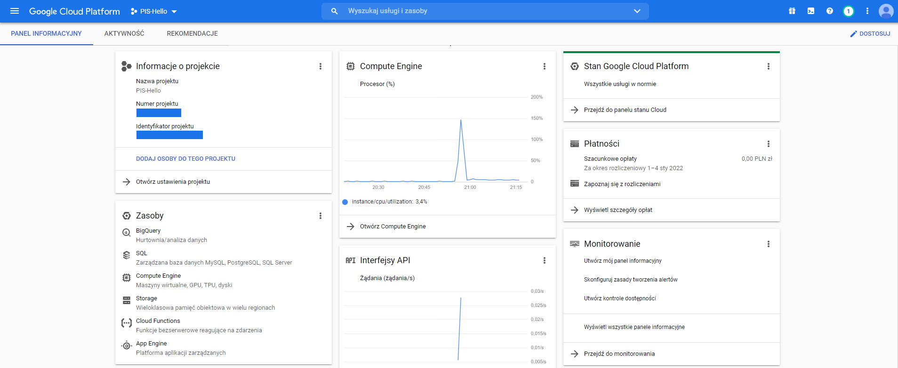
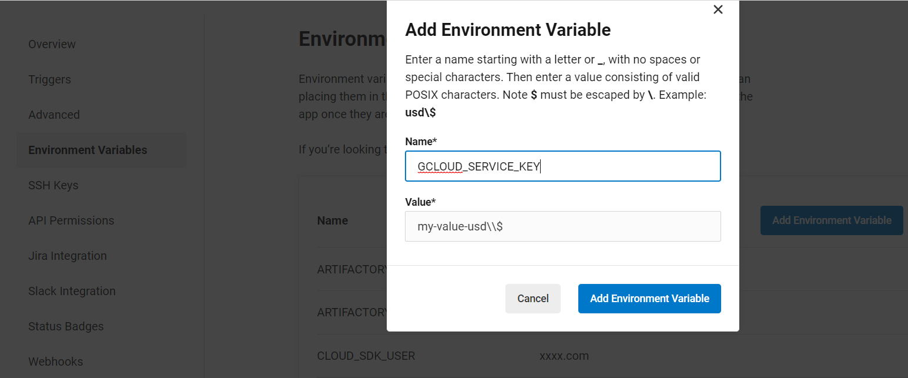

# GCP - wprowadzenie do jednej z najczęściej wybieranych platform chmurowych
W poniższym wpisie zostanie przedstawiona jedna z trzech największych platform chmurowych dla biznesu - GCP. Wpis ten jest poświęcony wprowadzeniu do tworzenia konta, tworzeniu maszyn wirtualnych oraz wdrażaniu zmian w projekcie na GCP za pomocą CircleCI.
## Spis treści
* [Czym jest GCP?](#czym-jest-gcp)
* [Rozpoczęcie pracy z Google Cloud Platform](#rozpoczęcie-pracy-z-google-cloud-platform)
* [Deployment z CircleCI na GCP](#deployment-z-circleci-na-gcp)
## Czym jest GCP?
GCP, a właściwie Google Cloud Platform jest kompleksową platformą chmurową do rozwoju i utrzymywania usług internetowych. GCP umożliwia przechowywanie danych oraz budowanie i przechowywanie programów. Google Cloud Platform zapewnia nam dostępność, uniwersalność, stabilność oraz bezpieczeństwo. Przy budowie własnej infrastruktury chmurowej, Google udostępnia nam wiele zaawansowanych narzędzi oraz usług:
- Compute Engine - usługa maszyn wirtualnych w infrastrukturze Google.
- Cloud Storage - usługa przechowywania danych w chmurze Google
- Cloud SDK - narzędzia i biblioteki do interakcji z produktami i usługami Google Cloud
- Cloud SQL - usługa bazy danych w chmurze (DBaaS)
- Cloud Run - usługa umożliwiająca rozwijanie i wdrażanie wysoce skalowalne skonteneryzowane aplikacje
- Google Kubernetes Engine - umożliwia automatyczne wdrażanie, skalowanie i zarządzanie Kubernetes.
- BigQuery - skalowalna hurtownia danych w chmurze
- i wiele innych... 

## Rozpoczęcie pracy z Google Cloud Platform
#### Stworzenie konta
Aby rozpocząć pracę w GCP i mieć dostęp do oferowanych usług musimy najpierw założyć konto w Google Cloud Platform. Konto możemy założyć przechodząc na stronę [Google Cloud Platform](https://console.cloud.google.com/getting-started?hl=PL). 


Na stronie możemy znaleźć informację o bezpłatnym okresie próbnym. Nie musimy się więc martwić o dodatkowe wydatki związane z naszym projektem przez najbliższe 90 dni. Przy bardziej zaawansowanych projektach korzystających z kilku wirtualnych maszyn musimy jednak kontrolować nasze konto, i korzystać mądrze z udostępnionych środków.
> Bezpłatne środki o wartości 300 dolarów
Skorzystaj z możliwości Google Cloud, przeznaczając na to otrzymane od nas środki w wysokości 300 USD do wykorzystania przez najbliższe 90 dni.

Tworzymy konto za pomocą konta Gmail. 


Kolejnym krokiem jest weryfikacja naszego konta za pomocą numeru telefonu


Ostatnim krokiem jest weryfikacja informacji o płatności. Jak informuje Google

> Twoje informacje dotyczące płatności pomagają nam zapobiegać oszustwom i nadużyciom. Nie naliczymy żadnych opłat, dopóki nie włączysz automatycznego naliczania płatności.

Nie musimy się więc przejmować dodatkowymi opłatami i możemy bez obawy podać nasze dane oraz numer karty.


Po udanym założeniu konta możemy cieszyć się z usług które dostarcza nam Google Cloud Platform.

W niektórych przypadakch nasze konto zostaje jednak tymczasowwo zawieszone. Google Cloud Platform pzesyła wtedy e-mail z prośbą o dodatkową weryfikację.


Aby zweryfikować należy przesłać zdjęcie karty która została wykorzystana do aktywacji konta oraz dowód tożsamości ze zdjęciem, potwierdzające podane przez nas dane.
Następnie otrzymujemy email z informacją o rozpatrywaniu naszej prośby. 
> Rozpatrzenie Twojej prośby może zająć do 48 godzin. Gdy tylko podejmiemy decyzję, wyślemy do Ciebie e-maila.  

Po udanej weryfikacji możemy w pełni korzytsać z Google Cloud! 


#### Podstawowe działania na GCP
Po zalogowaniu się na GCP za pomocą naszego konta widzimy stronę główną naszego projektu. Mamy łatwy dostęp do naszego projektu oraz najważniejszych usług.



#### Przyznanie dostępu
W Google Cloud Platform w łatwy sposób możemy dodać użytkowników oraz przypisać im role dla projektów i usług.

Dodanie użytkownika dokonujemy przez kliknięcie w przycisk **`DODAJ OSOBY DO TEGO PROJEKTU`** lub wybranie z *`Menu`* usługi *`Administracja`*. W sekcji *Uprawnienia* znajduje się lista wszystkich kont, które mają dostęp do projektu. Aby dodać nowe konto należy kliknąć w przycisk **`DODAJ`**. 


Aby dodać konto, adres użytkownika musi być kontem Google. W sekcji *`Nowe podmioty zabezpieczeń`* wpisujemy adres użytkownika, a następnie z sekcji *`Wybierz rolę`* ustawiamy rolę dla konta.
Na podany email zostanie przesłany email który umożliwi dostęp do projektu.

#### Stworzenie Compute Engine
Compute Engine jest usługą maszyn wirtualnych w infrastrukturze Google. W Compute Engine możemy uruchomić dowolny program, np. umożliwia nam hostowanie naszej aplikacji. 

Aby stworzyć nową maszynę wirualną z *`Menu`*  wybieramy *`Compute Engine`*. Następnie w sekcji *`Instancje maszyn wirtualnych`* wybieramy przycisk **`UTWÓRZ INSTANCJĘ`**. Zostaniemy przeniesieni do panelu konfiguracyjnego.


W powyższym panelu ustalamy nazwę maszyny, region oraz strefę.
Podczas tworzenia maszyny wirtualnej ustalamy ustawienia maszyny, rodzaj procesora, pojemność dysku oraz system operacyjny. Elementy te mają wpływ na koszt instancji, dlatego należy wybierać je mądrze, i nie wybierać ustawień ponad nasze potrzeby. Przewidywana miesięczna kwota znajduje się w prawym górnym rogu.

Konfiguracja maszyny - wybieramy rodzaj predefiniowanych maszyn w zależności od potrzeb projektu. Wskazujemy serie oraz typ maszyny.


Dysk rozruchowy - panel ten umożliwia zmianę systemu operacyjnego oraz jego wersję. Ustalamy również typ dysku oraz rozmiar.
Zapora sieciowa - zaznaczamy nasłuchiwanie portów HTTP i HTTPS.

Po zakończeniu konfiguracji klikamy **`UTWÓRZ`**, i już po chwili mamy dostęp do naszej maszyny wirtualnej.


Do maszyny możemy podłączyć się za pomocą SSH. Po kliknięciu uruchamia się wiersz poleceń, który umożliwia pracę w maszynie wirtualnej. 


## Deployment z CircleCI na GCP
W dalszej części przedstawię jak za pomocą platformy CI `CircleCI` zrobić deployment naszego serwera z repozytorium git na GCP. W naszym repozytorium git znajduje się serwer napisany w języku Kotlin z pomocą biblioteki Spring Boot.

#### Autoryzacja - [Źródło](https://circleci.com/docs/2.0/google-auth/)

Do deploymentu z CircleCI zostanie wykorzystany [Google Cloud SDK](https://cloud.google.com/sdk/). Są to narzędzia i biblioteki do interakcji z produktami i usługami Google Cloud. Narzędzie te umożliwia dostęp do serwisów Google Cloud Platform takich jak 
Google Compute Engine. W CircleCI jesto to rekomendowany sposób depolymentu naszej aplikacji na GCP.

Przed użyciem Google Cloud SDK musimy autoryzować gcloud. Google oferuje dwa rodzaje autoryzacji: user accounts i service accounts. Service account - jest to specjalny rodzaj konta używanego przez aplikację, za pomocą którego usługa weryfikuje się, a następnie konto może nadać uprawnienia umożliwiające dostęp do potrzebnych mu zasobów, co powoduje, że konto usługi jest tożsamością usługi.   W CircleCI wykorzystujemy service accounts.

Ustawienie dostępu do Google Cloud SDK:
1. Aby umożliwić dostęp do narzędzi Google Cloud SDK, musimy stworzyć service accounts. Aby stworzyć service account wykonujemy kroki 1-3 z danej [instrukcji](https://cloud.google.com/sdk/docs/authorizing#authorizing_with_a_service_account). Wybieramy format klucza jako JSON, oraz pobieramy klucz.
2. Dodajemy klucz do CircleCI. Przechodzimy do naszego projektu w CircleCI. W ustawieniach wybieramy *Environment Variables* a następnie dodajemy zmienną za pomocą przycisku *`Add Environment Variable`*   Ustawiamy nazwę zmiennej na np. GCLOUD_SERVICE_KEY oraz wprowadzamy nasz klucz.
3. Ustawiamy dodatkowo 2 zmienne w CircleCI (tak jak powyżej):
  - GOOGLE_PROJECT_ID(ID projektu) 
  - GOOGLE_COMPUTE_ZONE(strefa).

#### Plik config.yml
Autoryzacja - do autoryzacji Google Cloud SDK użyjemy *gcloud* oraz ustalimy kilka domyślnych ustawień. Edytujemy nasz plik config.yml
```
version: 2.1
jobs:
  deploy:
    docker:
      - image: google/cloud-sdk
    steps:
      - run:
          name: "Upload server"
          command: |
            echo $GCLOUD_SERVICE_KEY | gcloud auth activate-service-account --key-file=-
            gcloud --quiet config set project ${GOOGLE_PROJECT_ID}
            gcloud --quiet config set compute/zone ${GOOGLE_COMPUTE_ZONE}
```


#### Deployment serwera
Naszym celem jest deployment naszego prostego serwera wypisującego "Hello World" na porcie 8080. Jak wcześniej było wspomniane, zakładamy że nasza aplikacja jest napisana w języku Kotlin z pomocą biblioteki Spring Boot. Aby zrobić deployment najpierw musimy zbudować self-executable jar. Dokonujemy tego za pomocą Spring Boota. Wtyczka Spring Boot opakowuje jar-y z zależnościami w kolejny jar, jedyne czego potrzebujemy to *plugins*. Kolejnym krokiem jest zbudowanie aplikacji za pomocą *Gradle build*. Nasz aplikacja *hello.jar* znajduję się w folderze *build/libs*.

#### Implementacja w CircleCI 
Naszym celem jest deployment naszego .jar na wcześniej stworzoną maszynę wirtualną (pis) w GCP. Aby tego dokonać, w CircleCI musimy zbudować naszą aplikację znajdującą się w folderze server.
```
cd server && gradle build
```
Następnie zapisujemy nasz plik .jar do wybranego folderu.
```
mkdir -p /tmp/app/server
cp server/build/libs/hello.jar /tmp/app/server
```
Za pomocą persist_to_workspace przechowujemy nasz plik tymczasowy, który ma być użyty przez inne zadanie w workflow.
```
  store_results:
    docker:
      - image: gradle:jdk11-alpine
    steps:
      - run:
          name: "Build app"
          command: "cd server && gradle build"
      - run:
          name: "Store jar"
          command: |
            mkdir -p /tmp/app/server
            cp server/build/libs/hello.jar /tmp/app/server
      - persist_to_workspace:
          root: /tmp/app
          paths:
            - server/hello.jar
```

Na zakończenie (czas najwyższy :wink:), po zapisani pliku .jar, możemy przejść do deploymentu naszego pliku. Według wcześniejszych kroków dokonujemy autoryzacji. Wykorzystujemy *attach_workspace*, który służący do dołączenia przestrzeni roboczej workflow'a do bieżącego kontenera. Cała zawartość dołączanej przestrzeni roboczej jest pobierana i kopiowana do bieżącej przestrzeni roboczej. 
Do przesłania pliku wykorzystujemy gcloud compute scp, który umożliwia kopiowanie plików do i z maszyn wirtualnych Google Compute Engine za pomocą scp.
```
gcloud --quiet compute scp --recurse /tmp/app/server/hello.jar $USER@pis:~/pis
```

Aby uruchomić nasz program z poziomu CircleCI możemy posłużyć się gcloud compute ssh, przez podanie komend bashowych.
Poniższy kod wyłącza (jeśli taki istenieje) działający serwer na porcie 8080 a następnie uruchamia nasz nowy serwer w tle.
```
  deploy:
    docker:
      - image: google/cloud-sdk
    steps:
      - attach_workspace:
            at: /tmp/app
      - checkout
      - run:
          name: "Upload server"
          command: |
            echo $GCLOUD_SERVICE_KEY | gcloud auth activate-service-account --key-file=-
            gcloud --quiet config set project ${GOOGLE_PROJECT_ID}
            gcloud --quiet config set compute/zone ${GOOGLE_COMPUTE_ZONE}
            
            gcloud --quiet compute scp --recurse /tmp/app/server/hello.jar $USER@pis:~/pis
      - run:
          name: "Run server"
          command: |
            gcloud --quiet compute ssh $USER@pis --strict-host-key-checking=no --command "fuser 8080/tcp && fuser -k 8080/tcp || echo 0"
            gcloud --quiet compute ssh $USER@pis --strict-host-key-checking=no --command "cd pis && nohup java -jar hello.jar &>/dev/null &" &
            gcloud --quiet compute ssh $USER@pis --strict-host-key-checking=no --command "exit"
```
#### Compute Engine
Jak widzimy początkowo na maszynie wirtualnej nie mamy naszego pliku .jar. Po wprowadzeniu zmian w kodzie źródłowym serwera na gicie, uruchamiany jest CircleCI, który dokonuje deployment na GCP. Po krótkiej chwili mamy nasz plik .jar oraz działający serwer.


## Bibliografia:
https://cloud.google.com/products  
https://raw.githubusercontent.com/gregsramblings/google-cloud-4-words/master/DarkPoster-lowres.png  
https://circleci.com/docs/2.0/google-auth/  
https://cloud.google.com/sdk/docs/authorizing#authorizing_with_a_service_account  
https://www.baeldung.com/kotlin/gradle-executable-jar#fat-jar-for-the-light-weight-application  
https://circleci.com/docs/2.0/configuration-reference/#persisttoworkspace

