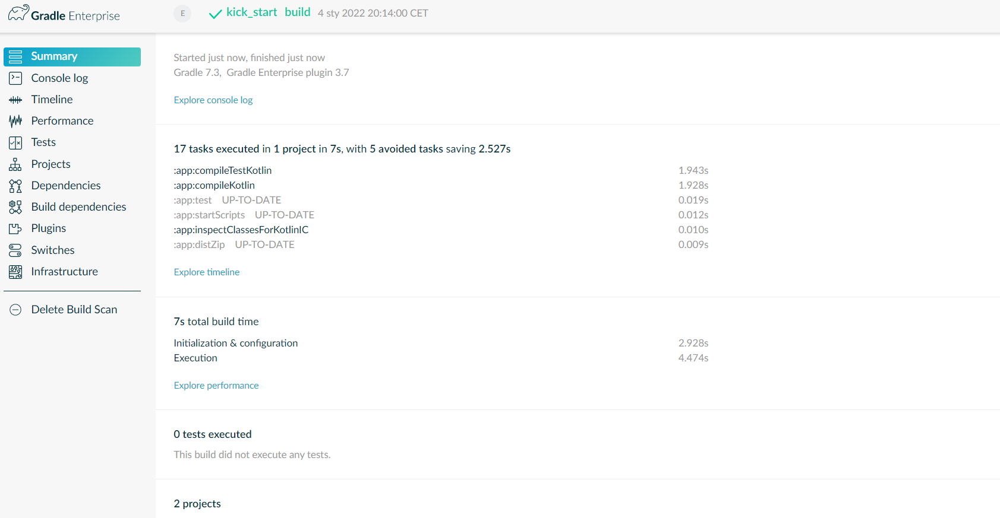
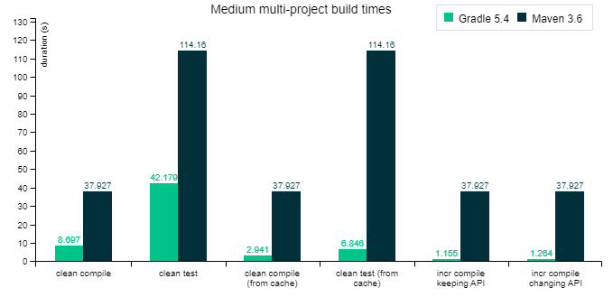

# Gradle - kick start
Poniższy artykuł poświęcony jest narzędziu służącemu do budowy projektów, czyli **Gradle**. 

### Spis treści
 1. [Czym w ogóle jest Gradle?](#czym-w-ogóle-jest-gradle) 
 2. [Trochę teorii](#trochę-teorii) 
 3. [Pierwsze kroki](#pierwsze-kroki) 
	 1. [Instalacja](#instalacja) 
	 2. [Budowanie aplikacji](#budowanie-aplikacji) 
	 3. [Uruchomienie aplikacji](#uruchomienie-aplikacji) 
	 4. [Dodatkowe polecenia Gradle](#dodatkowe-polecenia-gradle) 
	 5. [Przejrzenie utworzonych plików](#przejrzenie-utworzonych-plików)
 4. [Gradle vs Maven ](#gradle-vs-maven)  
 5. [Bibliografia ](#bibliografia )

## Czym w ogóle jest Gradle? 
Zgodnie z opisem podanym przez twórcę Gradle jest narzędziem do automatyzacji kompilacji do tworzenia oprogramowania w wielu językach. Opisując Gradla własnymi słowami powiedziałabym, iż jest to elastyczne narzędzie, które służy do budowy projektów. 

## Trochę teorii
Na początku spojrzymy na Gradle od strony teoretycznej, aby zrozumieć jak to narzędzie działa w praktyce.

Gradle buduje projekt w trzech fazach:
- faza inicjalizacji,
- faza konfiguracji,
- faza wykonania.

W **fazie inicjalizacji** Gradle określa jakie projekty wchodzą w skład naszego projektu. Brzmi to jak masło maślane, jednak chodzi o to, czy projekt nasz jest prosty (składa się wyłącznie z jednego projektu) czy jest złożony (składa się z wielu podprojektów). W fazie inicjalizacji określamy więc tak naprawdę jakie podprojekty wchodzą w skład naszego projektu. Następnie dla każdego z podprojektów zostaje stworzona osobna instancja, która przechowuje konfigurację danego podprojektu. Następnie w **fazie konfiguracji** wykonywany zostaje każdy z plików konfiguracyjnych projektu. W wyniku wykonania tej fazy obiekty, które powstały w poprzedniej fazie dla każdego podprojektu, są odpowiednio konfigurowane. Na koniec w **fazie wykonania** Gradle określa zestaw wymaganych do wykonania zadań oraz ich kolejność. Zadania te zostały utworzone i skonfigurowane w poprzedniej fazie. Na końcu tej fazy Gradle wykonuje każde z zadań zgodnie z określoną kolejnością.  

Gradle modeluje proces budowy jako ukierunkowany graf acykliczny (DAG) zadań. Kompilacja konfiguruje zestawy zadań i łączy je ze sobą w oparciu o ich zależność. Dzięki temu powstaje DAG. Poniżej znajdują się dwa przykładowe wykresy zadań. Wykres po lewej jest wykresem abstrakcyjnym. Oba wykresy pochodzą z oficjalnej strony Gradle. 


## Pierwsze kroki
W tym rozdziale opiszę od czego należy zacząć przygodę z Gradle.

### Instalacja
Jeśli nigdy wcześniej nie miałeś do czynienia z Gradlem, swoją przygodę powinieneś zacząć od jego instalacji. Jeśli chcesz tylko uruchomić istniejącą kompilację Gradle nie zawsze musisz instalować Gradle, jednak w tym poradniku skupimy się na tworzeniu własnej kompilacji. Wszelkie informacje odnośnie instalacji Gradle znajdują się na oficjalnej stronie  - [o tutaj](https://docs.gradle.org/current/userguide/installation.html).

### Budowanie aplikacji
Aby inicjować nowy projekt Gradle potrzebujemy pustego folderu, w którym znajdować będzie się nasz projekt. W pustym folderze uruchamiamy polecenie `gradle init`, które rozpocznie inicjalizację nowego projektu. W terminalu ukażą się nam pytania o kilka ustawień. Poniższa konfiguracja jest pokazana dla aplikacji w języku Kotlin.

```
Select type of project to generate:
  1: basic
  2: application
  3: library
  4: Gradle plugin
Enter selection (default: basic) [1..4] 2

Select implementation language:
  1: C++
  2: Groovy
  3: Java
  4: Kotlin
  5: Scala
  6: Swift
Enter selection (default: Java) [1..6] 4

Split functionality across multiple subprojects?:
  1: no - only one application project
  2: yes - application and library projects
Enter selection (default: no - only one application project) [1..2] 1

Select build script DSL:
  1: Groovy
  2: Kotlin
Enter selection (default: Kotlin) [1..2] 1

Generate build using new APIs and behavior (some features may change in the next minor release)? (default: no) [yes, no]
                                                                                                                       no

Project name (default: test): kick_start
Source package (default: kick_start): kick_start

> Task :init
Get more help with your project: https://docs.gradle.org/7.3/samples/sample_building_kotlin_applications.html

BUILD SUCCESSFUL in 19m 54s
2 actionable tasks: 2 executed
```
Poniżej znajduje się struktura stworzonego przez nas projektu: 

```

├── app
|   ├── build.gradle 
│   └── src
│       ├── main
│       │   └── kotlin 
│       |           └── kick_start
│       |                  └── App.kt
│       └── test
│           └── kotlin 
│                   └── kick_start
│                          └── AppTest
├── gradle
│   └── wrapper
|       ├── gradle-wrapper.jar
│       └── gradle-wrapper.properties
├── gradlew 
├── gradlew.bat 
└── settings.gradle 
```

Dzięki `gradle init` uzyskaliśmy konfigurację projektu, dzięki czemu możemy teraz zbudować aplikację w Kotlinie :D 

### Uruchomienie aplikacji
Teraz możemy uruchomić naszą aplikację bezpośrednio z wiersza poleceń za pomocą `./gradlew run`.  Po uruchomieniu stworzonej przez nas wcześniej aplikacji uzyskamy poniższy wynik:

```
> Task :app:compileKotlin
'compileJava' task (current target is 15) and 'compileKotlin' task (current target is 1.8) jvm target compatibility should be set to the same Java version.

> Task :app:run
Hello World!

BUILD SUCCESSFUL in 20s
2 actionable tasks: 2 executed
```

### Dodatkowe polecenia Gradle
Istnieje więcej poleceń Gradle. Tutaj omówię jeszcze jedno - `./gradlew build`. Polecenie to spakuje naszą aplikację wraz ze wszystkimi zależnościami. Dzięki temu będzie można uruchomić aplikację za pomocą jednego polecenia. Po wykonaniu powyższego polecenia dla stworzonej przez nas aplikacji powstały archiwa w dwóch formatach (`.tar` oraz `.zip`). Znajdują się one w folderze `app/build/distributions`. 

Jeśli używamy *gradlew* nie potrzebujemy instalować Gradle lokalnie, co jest bardzo dużą zaletą tego rozwiązania. Dodatkowo spakowany plik, który wygenerujemy będzie spójny za każdym razem. Jest to szczególnie ważne podczas pracy w grupie, ponieważ każdy może posiadać inną wersję Gradle na swoim komputerze. 

Powyższe polecenie możemy uruchomić również z flagą `--scan`, dzięki czemu możemy zobaczyć szczegóły co zostało wykonane - jakie zadania zostały wykonane, jakie zależności zostały pobrane itp.  Skan kompilacji zostanie opublikowany na stronie, a link do niej zostanie nam podany po zakończeniu wywołania polecenia. Poniżej znajduje się screen ze strony zawierającej szczegóły odnośnie naszego przykładowego projektu:



### Przejrzenie utworzonych plików
Poprzednie kroki wystarczą, aby rozpocząć tworzenie aplikacji. Jeśli jednak chcemy zrozumieć, czym są, co zawierają i co robią utworzone pliki to właśnie w tym podrozdziale skupimy się na nich. 

Na początku spojrzymy na plik `settings.gradle`. 
```kotlin
rootProject.name = 'kick_start'  
include('app')
```

Druga linia pliku definiuje z ilu podprojektów składa się nasz projekt - w tym przypadku jest to tylko jeden podprojekt `app`. Jeśli mielibyśmy projekt składający się z większej ilości podprojektów byłyby one dodane za pomocą kolejnych wyrażeń `include('name')`.

Zgodnie z tym co opisałam w fazach budowania projektu, Gradle dla każdego podprojektu tworzy instancję , która przechowuje konfigurację danego podprojektu. W naszym przykładzie mamy tylko jeden podprojekt, więc możemy znaleźć w nim jedną instancję zawierającą konfigurację. Konfiguracja znajduje się w folderze `app` w pliku `build.gradle`.

```kotlin
plugins {  
  id 'org.jetbrains.kotlin.jvm' version '1.5.31'  
  
  id 'application'  
}  
  
repositories {   
  mavenCentral()  
}  
  
dependencies {  
  implementation platform('org.jetbrains.kotlin:kotlin-bom')  
  
  implementation 'org.jetbrains.kotlin:kotlin-stdlib-jdk8'  
  
  implementation 'com.google.guava:guava:30.1.1-jre'  
  
  testImplementation 'org.jetbrains.kotlin:kotlin-test'  
  
  testImplementation 'org.jetbrains.kotlin:kotlin-test-junit'  
}  
  
application {   
  mainClass = 'kick_start.AppKt'  
}
```

W `plugins` zostały zaimplementowane wszystkie wtyczki potrzebne do działania naszego projektu:
- `org.jetbrains.kotlin.jvm` - dodaje obsługę Kotlina,
- `application` - dodaje obsługę tworzenia aplikacji.

W `repositories` deklarowane są publicznie dostępne repozytoria - w tym przypadku jest to `mavenCentral`, który zawiera biblioteki open source.

W `dependencies` zarządzamy zależnościami:
- biblioteka `kotlin-bom` wyrównuje wszystkie komponenty z tej samej wersji,
- `org.jetbrains.kotlin:kotlin-stdlib-jdk8` definiuje, iż chcemy skorzystać ze standardowej biblioteki Kotlin JDK8,
- `com.google.guava:guava:30.1.1-jre` definiuje, iż chcemy skorzystać w naszej aplikacji z Guavy. Guava to zestaw podstawowych bibliotek Google dla języka Java,
- `org.jetbrains.kotlin:kotlin-test` definiuje, iż chcemy skorzystać z biblioteki testowej Kotlin,
- `org.jetbrains.kotlin:kotlin-test-junit` definiuje, iż chcemy skorzystać z Kotlin JUnit.

W `application` zdefiniowana jest główna klasa aplikacji, czyli `kick_start.AppKt`.

 ## Gradle vs Maven 
 Zarówno Gradle jak i Maven służą do budowy projektów. Poniżej znajduje się tabela przedstawiająca najważniejsze różnice między tymi narzędziami.
 
| Gradle| Maven |
| :--: | :--: |
| Unika kompilacji | Kompilacja jest obowiązkowa |
| Używa DSL (Domain-specific language) do tworzenia struktury projektu| Używa XML do tworzenia struktury projektu |
| Główny cel to dodanie funkcjonalności do projektu | Skupiony na tworzeniu aplikacji w określonym czasie |
 Nowe narzędzie, potrzeba czasu, aby się z nim zapoznać| Znane narzędzie |
 | Zoptymalizowane pod kątem śledzenia tylko bieżącego uruchomionego zadania - uruchamia tylko te zadania, które zostały zmienione | Nie używa pamięci podręcznej - czas budowy jest dłuższy |
 | System automatyzacji kompilacji | System zarządzania projektami oprogramowania |


Poniżej znajdują się również wykresy porównujące wydajność Gradle i Maven. Na wykresie przedstawiony został czas, w jakim oba narzędzia zbudowały średni, złożony projekt:

 

Gradle jest zdecydowanie wydajniejszy niż Maven. Zgodnie z pomiarami ze strony *gradle.org*, Gradle potrafi być do 100 razy szybszy niż Maven.
## Bibliografia 
 - https://docs.gradle.org/current/userguide/what_is_gradle.html
 - https://docs.gradle.org/current/userguide/getting_started.html
 - https://docs.gradle.org/current/userguide/installation.html
 - https://docs.gradle.org/current/samples/sample_building_kotlin_applications.html
 - https://docs.gradle.org/current/userguide/declaring_repositories.html
 - https://docs.gradle.org/current/userguide/dependency_management.html
 - https://stackoverflow.com/questions/59790315/what-does-kotlin-bom-library-do
 - https://github.com/google/guava
 - https://tomgregory.com/gradle-vs-gradlew-difference/
 - https://gradle.org/gradle-vs-maven-performance/

