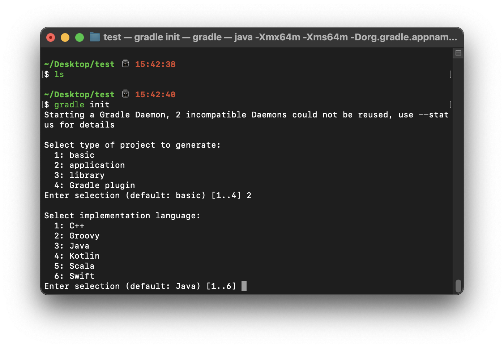

# Wiosna na wyspie lisów
Ten poradnik powie wam jak napisać podstawową aplikację internetową w języku Kotlin z pomocą biblioteki Spring Boot

### Spis treści
[Dlaczego Kotlin?](#dlaczego-kotlin) \
[Dlaczego Spring Boot?](#dlaczego-spring-boot) \
[Ustawienie środowiska](#ustawienie-środowiska) \
[Hello World](#hello-world) \
[Inne podstawowe funkcje](#inne-podstawowe-funkcje)

## Dlaczego Kotlin?

Kotlin to całkiem nowy język, który początkowo miał być równie bogaty w funkcjonalności co Scala, a jednocześnie kompilować i uruchamiać się znacznie od niej szybciej. Według mnie, posiada on jedną z najprostszych i najbardziej zrozumiałych składni ze wszystkich języków, nie tracąc na tym znacznie na prędkości ani stabilności napisanych programów. Dodatkowo, większość stosowanych wydań Kotlina jest oparta na JVM'ie, co ma swoje wady i zalety, ale jedną z większych zalet tego rozwiązanie jest dostęp do bogactwa bibliotek Javy, która ma ich bardzo, bardzo dużo.

## Dlaczego Spring Boot?

Spring to bibiloteka, która pozwala bardzo łatwo i szybko napisać aplikację, która po prostu działa, a jednocześnie posiada wiele przydatnych funkcjonalności.

Sam Spring jest około dwa razy starszy od Kotlina, jednak jest to jedna z nowszych i popularniejszych bibliotek dostępnych w Javie, która jest wciąż rozwijana. Posiada ona wiele wbudowanych funkcjonalności, która znacznie upraszcza chociażby tworzenie REST'owego API, łączenie z bazą danych, autentykację użytkowników, skalowalność i wiele innych.

## Ustawienie środowiska

*Uwaga! W ramach tego poradnika, zakładam że masz już zainstalowaną u siebie Javę (conajmniej w wersji 8), Gradle'a oraz podstawową znajomość Shell'a i jakiegoś obiektowego języka programowania. Osobiście, do Kotlina i Springa polecam używać edytora IntelliJ IDEA od JetBrains, jednak rozumiem, że nie każdy może mieć do niego dostęp, dlatego w poradniku będę tworzył projekt za pomocą terminala.*

<!-- Po utworzeniu folderu w którym chcemy, aby znajdował się nas projekt i otworzeniu w nim terminala, należy wpisać w nim:

```zsh
gradle init
```

Po chwili wyświetli nam się kilka prompt'ów. W pierwszych z nich wybieramy "application", czyli w moim przypadku 2:


Następnie naturalnie wybieramy Kotlin, czyli opcję 4:



Tu wybieramy 1:


Następnie wybieramy preferowany przez nas język skryptów Gradle'a. Osobiście, polecam wziąć Kotlina, zarówno dla osób które znają Groovy'ego, jak i tych, które o nim nie słyszały.


Ostatnie dwa pytania są o nazwę projektu oraz paczki. Można podać tu dowolne nazwy, jednak radziłbym użyć jako nazwy paczki albo nazwy swojej organizacji albo nazwy projektu jak takowej nie ma, tak żeby trzymać się ze standardem.


Po tych 6 krokach Gradle utworzy nam wiele plików, z czego nas głównie będzie interesować to co znajduję się w folderze "app" -->

Najłatwiej jest zacząć projekt wchodząc na [start.spring.io](https://start.spring.io) i po lewej stronie wybrać "Gradle Project" oraz "Kotlin", po czym w polach pod Project Metadata wpisać jakąś sensowną treść, czyli nazwę aplikacji w polu Name i Artifact, nazwę swojej organizacji w Group (np. w postaci com.google) i nazwę projektu w ramach którego jest ta aplikacja tworzona (może być ona także taka sama co nazwa aplikacji). Należy także na dole strony wybrać odpowiednią wersję Javy (tzn. taką, którą ma się u siebie zainstalowaną).


Po tym wszytkich należy po prawej stronie wybrać guzik ADD i dodać jako zależność: Spring Web.

Po dodaniu zależności, należy wcisnąć na dole strony GENERATE, rozpakować pobrane archiwum i voilà! Mamy już gotowy początek aplikacji!

Dla sprawdzenia czy wszystko mamy poprawnie zainstalowane, możemy wejść w terminal do folderu z tym projektem i wpisać:

```zsh
gradle build
```

Po jakimś czasie, jeśli się wszystko udało, powinniśmy ujrzeć:

```zsh
BUILD SUCCESSFUL in 48s
8 actionable tasks: 8 executed
```

oraz w projekcie powinien pojawić się nowy katalog o nazwie "build"

## Hello World

### Objaśnienie niektórych plików w projekcie

Przed rozpoczęciem pisania, zapoznajmy się z tym co właściwie wygenerował nam Spring Initializr

W ścieżce src/main/kotlin mamy plik o nazwie ...Application.kt, w moim przypadku DemoApplication.kt


W tym pliku znajduje się nasz "main", którego raczej nie będziemy zmieniać przez cały rozwój aplikacji.

Następny plik znajduje się w src/main/resources/application.properties


Obecnie jest on pusty, jednak to jest miejsce, w którym będziemy mogli zdefiniować większość zmiennych konfiguracyjnych - typu adres bazy danych, jej rodzaj, adresy innych naszych usług itp.

Ostatni z plików znajduje się w src/test/kotlin/.../DemoApplicationTests.kt


Tutaj znajduje się nasz pierwszy test -> test tego, czy aplikacja w ogóle się buduje i uruchamia. Można go uruchomić za pomocą polecenia:

```zsh
gradle test
```

### Pierwszy endpoint

Aby stworzyć nasz pierwszy endpoint, należy obok pliku DemoApplication.kt utworzyć katalog o nazwie "api", a następnie w nim plik o nazwie HelloEndpoint.kt. Oczywiście takie nazwy nie są obowiązkowe, mogą być inne, jednak użyjemy takich aby trzymać się konwencji.

Plik ten będzie wyglądał tak:

```kt
package com.example.demo.api

import org.springframework.web.bind.annotation.GetMapping
import org.springframework.web.bind.annotation.RestController
import org.springframework.web.bind.annotation.RequestMapping

@RestController
@RequestMapping("/hello")
class HelloEndpoint {
    @GetMapping("/world")
    fun index(): String = "Hello world"
}
```

Teraz: co tu się właściwie stało?

```kt
package com.example.demo.api
```

Na początku pliku, tak jak w każdym języku na JVM, mamy powiedziane w jakiej paczce znajduję się ten plik. Ma to znaczenie przy importowaniu plików.

```kt
import org.springframework.web.bind.annotation.GetMapping
import org.springframework.web.bind.annotation.RestController
import org.springframework.web.bind.annotation.RequestMapping
```

Następnie, importujemy trzy anotację, które będą nam potrzebne do poprawnego działania. Co dokładnie one robią za chwilę.

```kt
@RestController
@RequestMapping("/hello")
class HelloEndpoint
```

Przechodzimy teraz do sedna programu. Definiujemy klasę, która będzie **kontrolem** naszego endpoint'u.

Anotacja `RestController` mówi nam, że wszystkie endpointy tej klasy będą zwracać w body odpowiedzi to, co zwróci ich metoda. Innymi słowa, jeśli metoda zwróci zwykły tekst, to na tej stronie w przeglądarce zobaczymy ten tekst napisany na czarno domyślną czcionką na białym tle.

`@RequestMapping("/hello")` mówi nam, że wszystkie endpointy będą dostępne pod `{{adres_strony}}/hello`. Przykład tego co to oznacza pokażę poniżej.

```kt
@GetMapping("/world")
fun index(): String = "Hello world"
```

I wreszcie, definiujemy nasz endpoint. Za pomocą `fun index(): String` definiujemy metodę, która będzie zwracać String'a. W tym przypadku jest to "Hello world"

Anotacja `@GetMapping` mówi nam, że na ten endpoint można wysłać request z metodą HTTP GET. Natomiast `("/world")` mówi nam, że ten endpoint będzie dostępny pod adresem `{{adres_strony}}/hello/world` (pamiętając o tym, co zapisaliśmy w `@RequestMapping`)

### Uruchomienie aplikacji

To wszystko, co jest wymagane do stworzenia endpointu w Springu! Teraz zobaczmy jak to wygląda na żywo.

W naszym terminalu wpisujemy:

```zsh
gradle bootRun
```

Kiedy gradle pokaże nam, że jest wykonany w 83% to znak, że aplikacja się poprawnie odpaliła i możemy otworzyć przeglądarkę.

Domyślnie, gradle odpali nam aplikację na porcie 8080. W związku z czym, pod adresem **127.0.0.1:8080/hello/world** zobaczymy to:


I właśnie tak się robi endpoint w Springu i Kotlinie!

## Inne podstawowe funkcje

Rozwińmy trochę naszą aplikację:

```kt
package com.example.demo.api

import org.springframework.web.bind.annotation.GetMapping
import org.springframework.web.bind.annotation.PostMapping
import org.springframework.web.bind.annotation.RestController
import org.springframework.web.bind.annotation.RequestMapping
import org.springframework.web.bind.annotation.RequestParam

@RestController
@RequestMapping("/hello")
class HelloEndpoint {

    private var value = "Hello world"

    @GetMapping("/world")
    fun getWorld(): String = value

    @PostMapping("/world")
    fun postWorld(@RequestParam text: String) {
        value = text
    }
}
```

Zmieniliśmy aplikacje w następujący sposób

```kt
private var value = "Hello world"
```

Dodaliśmy prywatny, mutowalny atrybut klasy o nazwie `value` i domyślnej wartości `"Hello world"`. Nie musimy podawać typu, ponieważ Kotlin się sam jego domyśla. Jeśli chcielibyśmy nie mieć domyślnej wartości, to musielibyśmy już by ten typ podać. Wyglądałoby to tak:

```kt
private var value: String?
```

Zdefiniowaliśmy naszą zmienną `value` jako **nullowalny** String. Oznacza to, że w przeciwieństwie do zwykłego Stringa, ten typ może przyjmować także wartości będące null'em. Przykład ze wcześniejszego akapitu był typem `String`, a nie `String?`, ponieważ Kotlin jeśli nie musi, będzie używał domyślnie typów nie-nullowalnych.

```kt
@GetMapping("/world")
fun getWorld(): String = value
```

Następnie zmieniliśmy GETa tego endpointu, aby zwracał `value` zamiast sztywno wpisanego `"Hello world"`. Warto zauważyć, że Kotlin nie potrzebuję `this`, `self`, ani innych wyrazów kluczowych aby otrzymać atrybut obiektu. Można po prostu napisać jego nazwę.

```kt
@PostMapping("/world")
fun postWorld(@RequestParam text: String) {
    value = text
}
```

Dodaliśmy teraz kolejną metodę, która będzie reagowała na POST na ten same endpoint /hello/world. Zdefiniowaliśmy to za pomocą `@PostMapping("/world")`. Ta metoda przyjmuje dodatkowo argument: `@RequestParam text: String`. Argument ten, o nazwie `text` i typie `String`, jest jednocześnie parametrem request'u, dzięki zastosowanej anotacji.

Metoda ta pozwala nadpisać wartość `value` dowolnym tekstem. Warto dodać, że gdyby value było zdefiniowane jako `val`, a nie `var`, to byłoby ono nie-mutowalne i ta metoda wywołała by błąd na serwerze - słowo kluczowe `val` w Kotlinie działa podobnie, co `const` w innych językach.

Po wyjaśnieniu tego co zmieniliśmy, spróbujmy zobaczyć ponownie jak to wygląda.

Odpalamy aplikację w ten sam sposób co poprzednio, wykonujemy poniższe, przykładowe zapytanie:

```http
POST http://localhost:8080/hello/world?text=demo HTTP/1.1
```

Dzięki czemu po wejściu pod ten sam adres, co uprzednio, wyświetli nam się "demo"

